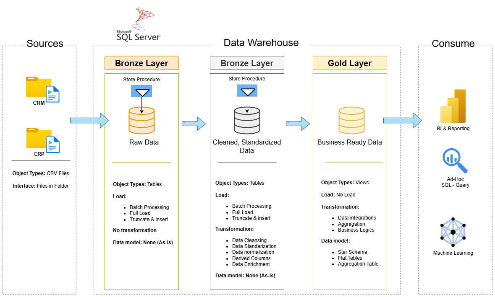

# Data Warehouse and Analytics Project

Welcome to **My Data Warehouse Project** repository !!!

This project demonstrates a comprehensive data warehousing and analytics solution, from building a data warehouse to generating actionable insight. Designed as a portfolio project highlights industry best practices in the data engineering and analytics.

---

## 🏗️ Data Architecture
The data architecture for this project follow by Medalion Architecture **Bronze**, **Silver**, and **Gold** layers:


1. **Bronze Layer**: Store raw data as-is source systems. Data is ingested from CSV Files to SQL Server Database.
2. **Silver Layer**: This layer include data cleansing, standardization, and normalization process to prepare data for analysis.
3. **Gold Layer**: Houses business-ready data modeled into a star schema required for reporting and analytics.

---
## 📖 Project Overview

This project involves:
1. **Data Architecture**: Designing a Modern Data Warehouse Using Medallion Architecture **Bronze**, **Silver**, and **Gold** layers.
2. **ETL Pipelines**: Extracting, transforming, and loading data from source systems into the warehouse.
3. **Data Modeling**: Developing fact and dimension tables optimized for analytical queries.
4. **Analytics & Reporting**: Creating SQL-based reports and dashboards for actionable insights.

🎯 This repository is an excellent resource for professionals and students looking to showcase expertise in:
- SQL Development
- Data Architect
- Data Engineering  
- ETL Pipeline Developer  
- Data Modeling  
- Data Analytics  

---
## 🚀 Project Requirement

### 🔧 Building the Data warehouse (Data Engineer)

#### Objective:
Develop a modern data warehouse using SQL Server to consolidate sale data, enable analytics reporting and informed decision-making.

#### Specifications:
  - **Data Source**: Import data from two source system (ERP & CRM) provide as CSV files.
  - **Data Quality**: Cleansed and resolve data quality issue prior to analysis.
  - **Integration**: Combine both source into a single, user-friendly data model designed for analytical queries.
  - **Scope**: Focus on the latest dataset only, historization of data is not require
  - **Documentation**: Provide clear documentation of data model to support both business stakeholders and analytics team

---

### 🧭 BI: Analytics & Reporting ( Data Analysis)

#### Objective: Develop SQL base Analytics to detailed insights into:

  - **Customer Behavior**
  - **Product Performance**
  - **Sales Trends**
    
  These insights empower stakeholders with keys business metrics, enabling strategic decision-making.

  ---
  ## 📂 Repository Structure

  ```
  Directory structure:
└── vdnghia03-sql-data-warehouse-project/
    ├── README.md
    ├── LICENSE
    ├── datasets/
    │   └── placeholder
    ├── docs/
    │   ├── Data_Flow.drawio
    │   ├── Data_Model.drawio
    │   ├── Integration_Model.drawio
    │   ├── data_architecture.drawio
    │   ├── gold_data_catalog.md
    │   ├── naming_convention.md
    │   └── placeholder
    ├── scripts/
    │   ├── init_database.sql
    │   ├── placeholder
    │   ├── bronze/
    │   │   ├── ddl_bronze.sql
    │   │   └── proc_load_bronze.sql
    │   ├── gold/
    │   │   ├── ddl_gold.sql
    │   │   └── quality_check_gold.sql
    │   └── silver/
    │       ├── bronze_quality_checks.sql
    │       ├── ddl_silver.sql
    │       └── proc_load_silver.sql
    └── tests/
        ├── placeholder
        ├── quality_checks_gold.sql
        └── quantity_checks_silver.sql

  ```
## 🛡️ License

This project is licensed under the [MIT License](LICENSE). You are free to use, modify, and share this project with proper attribution.
